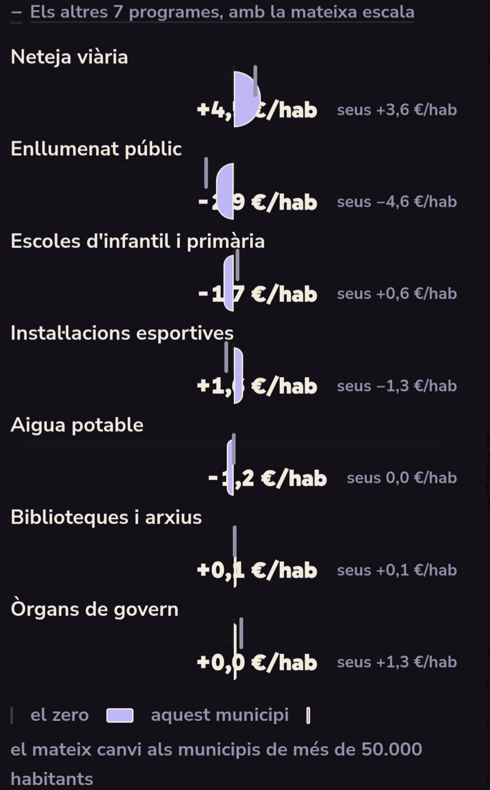

# quivoto

**Observatori municipal de Catalunya** i brúixola electoral per a les eleccions del 23 de maig de 2027.

> Dades obertes, fonts visibles i cap xifra sense explicar.

[](https://quivoto.cat) [](packages/pipeline)

## En directe

- [quivoto.cat](https://quivoto.cat) — portada en català
- [Observatori municipal](https://quivoto.cat/observatori/) — dades dels 947 municipis
- [Mapa](https://quivoto.cat/observatori/mapa/)
- [Dades descarregables](https://quivoto.cat/observatori/dades/)

## Què hi ha avui

El repositori ja publica un observatori estàtic amb 947 municipis, resultats electorals des de 1979, alcaldies, composició dels plens, candidatures, trajectòries, finances, despesa per serveis, criminalitat, fonts i fitxes descarregables. Les afirmacions de la brúixola són conjunts de prova editorial amb evidència; la resposta del votant encara viu només al navegador.



La captura mostra el tipus de gràfic que es revisa en cada publicació: mateixa escala, xifra explícita, comparació amb municipis semblants i taula accessible equivalent.

## Principis de dades

- Cada dada publicada porta font, any o període, unitat i explicació del buit.
- Les dades originals i les derivades no es confonen.
- Una font que no cobreix un municipi produeix “sense dades”, mai una estimació.
- Els actes només entren com a evidència quan l’extractor conserva la cita literal.
- Les respostes de la brúixola no s’envien al servidor.
- No es versionen bases de dades, correus, credencials ni fitxers de configuració.

## Arquitectura

```text
packages/shared-schemas   Tipus i càlcul de coincidència
packages/db               Esquema Drizzle + PGlite local / PostgreSQL
packages/pipeline         Adaptadors, jobs, derives, verificació i publicació
web/public                Landing PHP/HTML i Observatori estàtic
tools                     Generadors de landing, icones i assets
docs                      Metodologia, fonts i desplegament
```

El pipeline és determinista quan calcula mètriques: descarrega fonts oficials, normalitza, registra incidències i genera HTML estàtic. La base local és PGlite; producció pot usar PostgreSQL amb la mateixa API Drizzle.

## Desenvolupament

Requisits: Node.js 22+, Corepack/pnpm, Python 3 i `pdftotext` per als actes.

```bash
corepack pnpm install
corepack pnpm test
corepack pnpm typecheck
python3 tools/build_landing.py
corepack pnpm --filter @quivoto/pipeline start publica esplugues-de-llobregat
```

Per veure la web local:

```bash
php -S 127.0.0.1:8788 -t web/public
```

La publicació completa (`publica tots`) regenera els 947 municipis, índexs, fitxes, imatges socials, dades i sitemap. El desplegament de producció està documentat a [`docs/DESPLEGAMENT.md`](docs/DESPLEGAMENT.md).

## Estat i properes passes

La base de dades municipal i el pipeline de fonts ja funcionen. Les prioritats següents són normalitzar el registre de fonts i evidències, mesurar cobertura camp a camp, ampliar actes/contractació/subvencions i convertir els conjunts de preguntes verificats en una brúixola municipal completa.

Consulta el mètode a [`docs/METODOLOGIA.md`](docs/METODOLOGIA.md) i el pla de dades a [`docs/PLA-DADES-2027.md`](docs/PLA-DADES-2027.md).

## Llicència

El codi es publica sota MIT. Les dades originals conserven la llicència de l’organisme que les publica; les dades derivades de quivoto s’han de reutilitzar citant quivoto, la font original i la data de generació. Consulta [`web/README.md`](web/README.md) per a privadesa, formularis i desplegament.
